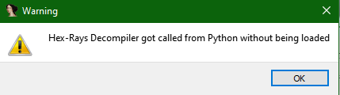

.. _gotchas_label:

Known gotchas
=============

.. versionadded:: 1.0

Importing the module
--------------------

To import _FIDL_ into your own programs, use the uppercase form of the name, that is:

``import FIDL`` or ``import FIDL.decompiler_utils as du`` will work, but

``import fidl`` will result in an import error

Bitness mismatch
----------------

Getting the following error message::

    "Hex-Rays Decompiler got called from Python without being loaded"

usually means that you are trying to decompile an x86 binary with the x86_64 version of IDA. The binary will still load and be analyzed but the decompiler plugin will fail.
